# LOLハイブリッドプラットフォーム 自動化フロー設計

## 1. 自動化フロー概要
本ドキュメントでは、League of Legends（LOL）ハイブリッドプラットフォームにおける自動化フローの設計を定義する。本システムでは以下の主要な自動化フローを実装する：

- Riot APIデータ収集・分析フロー
- コンテンツ自動収集・生成フロー
- WordPress連携・投稿フロー
- システム監視・最適化フロー

各フローの詳細設計を以下に記述する。

## 2. Riot APIデータ収集・分析フロー
### 2.1 マスターデータ更新フロー
チャンピオン、アイテム、ルーンなどのマスターデータを更新するフロー。
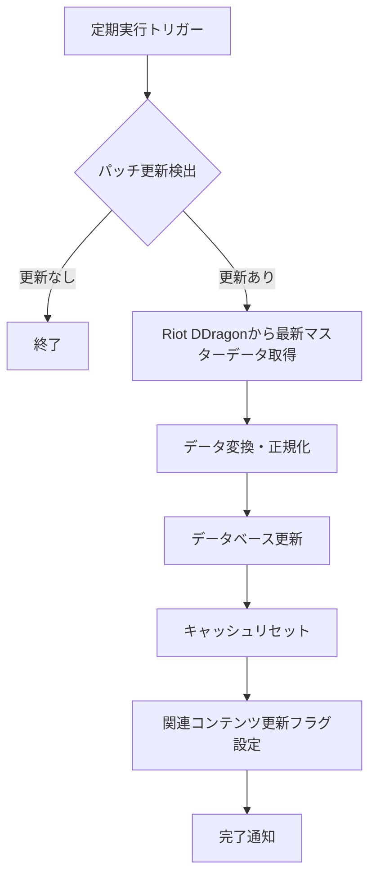
実行条件
- 毎日定時実行（AM 4:00）
- パッチリリース検出時即時実行

主要処理
- DDragon API最新バージョン確認
- 前回取得バージョンと比較
- 新バージョン検出時、全マスターデータ取得
- データ型変換・正規化
- データベース更新（古いバージョンは履歴として保持）
- 関連キャッシュのリセット

### 2.2 プレイヤーデータ収集フロー
検索されたプレイヤーの情報を収集するフロー。
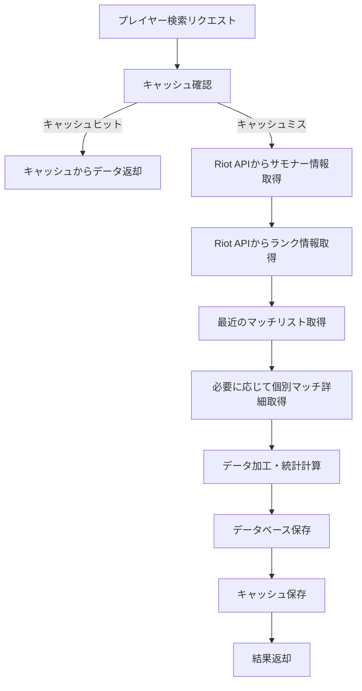
実行条件
- ユーザーからのプレイヤー検索リクエスト時
- 定期的なホットプレイヤー情報更新（1時間ごと）

主要処理
- キャッシュ確認（TTL：非ホットプレイヤー15分、ホットプレイヤー5分）
- Riot APIからサモナー基本情報取得
- ランク情報取得
- 最近のマッチIDリスト取得（直近20試合）
- 必要に応じてマッチ詳細取得
- KDA、勝率などの統計計算
- データ保存・キャッシュ更新

### 2.3 統計データ計算フロー
チャンピオン統計、マッチアップ統計などを計算するフロー。
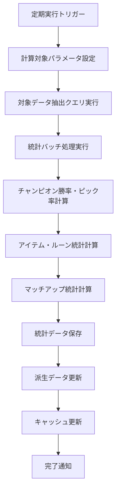
実行条件
- 日次バッチ処理（AM 3:00）
- パッチ更新後強制実行

主要処理
- 集計パラメータ設定（期間、ランク帯、地域など）
- 対象期間のマッチデータ抽出
- 各種統計情報計算
  - チャンピオン勝率、ピック率、バン率
  - ビルドパス分析
  - マッチアップ相性分析
  - 時間帯別統計
- 結果の保存・キャッシュ更新
- メタレポート用データフラグ設定

## 3. コンテンツ自動収集・生成フロー
### 3.1 外部情報収集フロー
RSS、公式サイト、Redditなどから情報を収集するフロー。
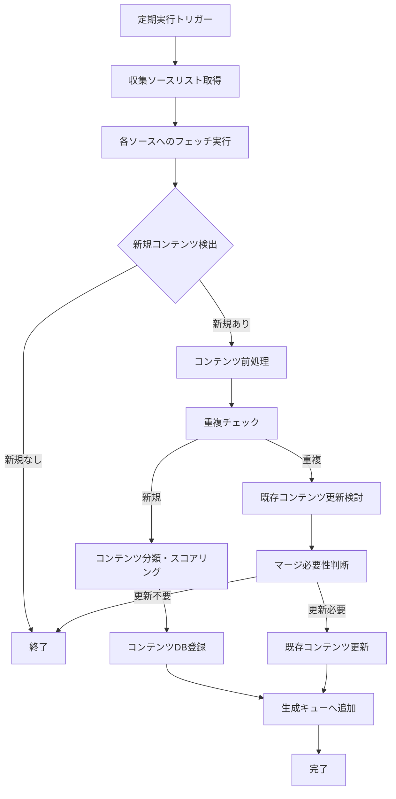
実行条件
- 情報ソース種別ごとに異なる頻度で実行
  - 公式パッチノート：1時間ごと
  - ニュースサイト：3時間ごと
  - Reddit：6時間ごと
  - プロチーム公式サイト：12時間ごと

主要処理
- アクティブなコンテンツソース設定の取得
- 各ソースに対するフェッチ処理実行
- 前回取得時からの差分抽出
- コンテンツの前処理（HTML除去、要素抽出など）
- 重複チェック（URL、タイトル、内容の類似度）
- コンテンツ分類（ニュース、パッチ情報、プロシーン、ガイドなど）
- 重要度スコアリング
- コンテンツDBへの登録
- AIコンテンツ生成キューへの追加

### 3.2 AIコンテンツ生成フロー
AIを活用して独自コンテンツを生成するフロー。
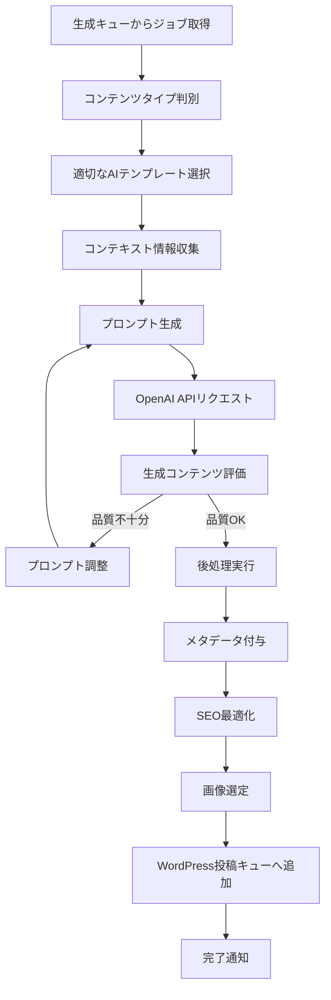
実行条件
- コンテンツ生成キューにジョブが追加されたとき
- 優先度に基づく実行順序制御
- 同時実行数制限（API制限考慮）

主要処理
- 生成キューからジョブ取得
- コンテンツタイプに基づくテンプレート選択
- 関連コンテキスト情報収集
  - 元記事内容
  - 関連チャンピオンデータ
  - 統計情報
  - 過去の類似記事
- プロンプト構築
- OpenAI API呼び出し
- 生成コンテンツの品質評価
  - 独自性スコア
  - 一貫性スコア
  - 有用性スコア
- 必要に応じてプロンプト調整と再生成
- 後処理
  - フォーマット調整
  - 内部リンク付与
  - メタデータ設定
- WordPress投稿キューへの追加

### 3.3 コンテンツ品質管理フロー
生成されたコンテンツの品質を評価・管理するフロー。
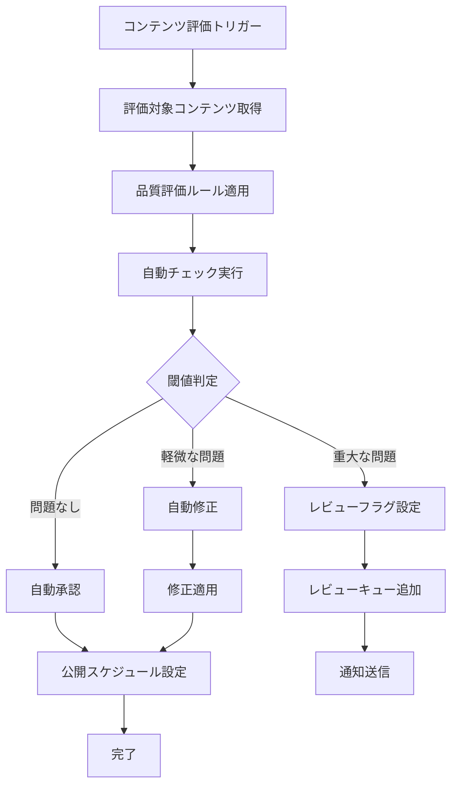
実行条件
- コンテンツ生成完了時
- 定期的な既存コンテンツ評価（週次）

主要処理
- 評価対象コンテンツの取得
- 品質評価ルールセットの適用
  - 文法チェック
  - 事実確認
  - SEO評価
  - 読みやすさ評価
  - 最新性チェック
- 自動判定
- 閾値に基づく処理分岐
- 問題の自動修正または人間レビュー依頼
- 公開スケジュール設定

## 4. WordPress連携・投稿フロー
### 4.1 WordPress投稿フロー
生成されたコンテンツをWordPressに投稿するフロー。
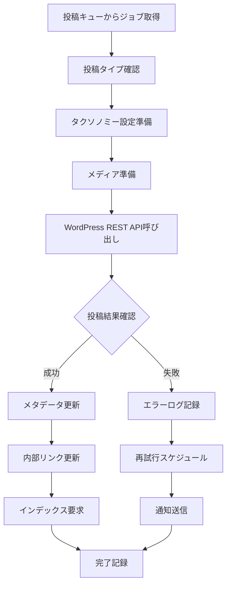
実行条件
- WordPress投稿キューにジョブが追加されたとき
- 公開スケジュールに基づく実行
- 優先度に基づく実行順序制御

主要処理
- 投稿キューからジョブ取得
- 投稿タイプに応じた設定準備
- タクソノミー（カテゴリ、タグ）設定
- 必要なメディア（画像など）の準備
- WordPress REST APIを使用した投稿作成
- 投稿結果の確認
- 関連メタデータの更新
- 内部リンク構造の更新
- 検索エンジンインデックス要求
- 完了記録

### 4.2 コンテンツ更新フロー
既存コンテンツを更新するフロー。
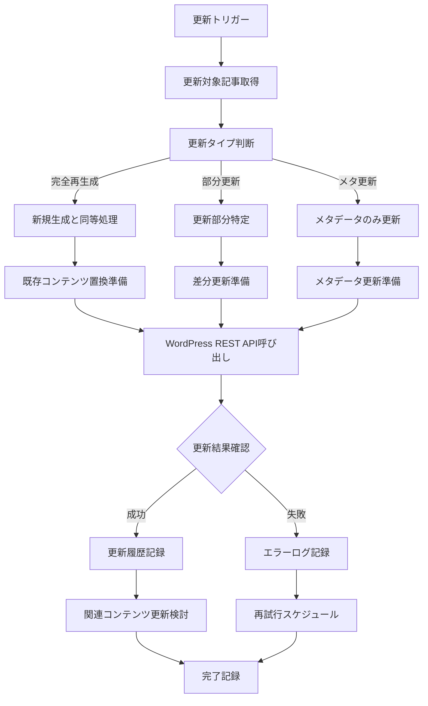
実行条件
- パッチ更新検出時
- 重要な統計データ変化検出時
- 定期的な鮮度チェック（月次）

主要処理
- 更新対象記事の特定
- 更新タイプの判断
  - 完全再生成（大幅な内容変更が必要）
  - 部分更新（特定セクションのみ更新）
  - メタデータのみ更新
- 更新内容の準備
- WordPress REST APIを使用した記事更新
- 更新履歴の記録
- 関連コンテンツの更新検討

## 5. システム監視・最適化フロー
### 5.1 API使用状況監視フロー
各APIの使用状況を監視するフロー。
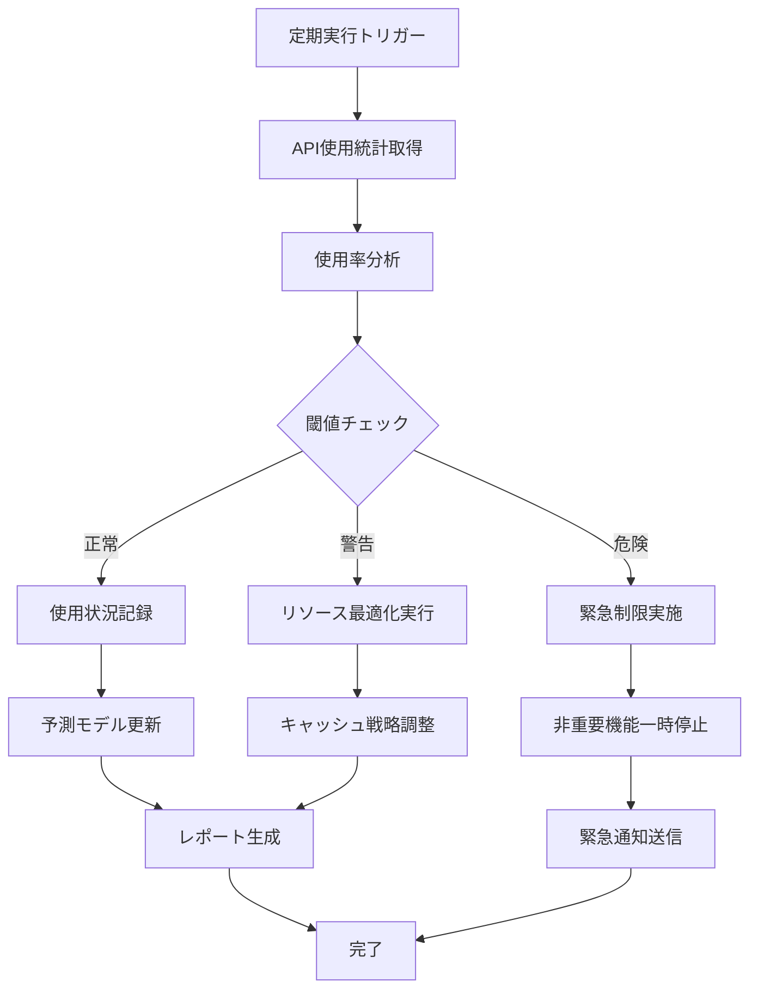
実行条件
- 1時間ごとの定期監視
- APIリクエスト数の急増検出時

主要処理
- 各API（Riot API、OpenAI API）の使用状況取得
- 使用率・残存クォータ分析
- 閾値に基づく状態判定
- 必要に応じたリソース最適化
  - キャッシュTTL調整
  - バッチ処理の遅延
  - リクエスト優先度管理
- 危険レベルでの緊急対応
- 使用状況レポート生成

### 5.2 パフォーマンス最適化フロー
システム全体のパフォーマンスを監視・最適化するフロー。
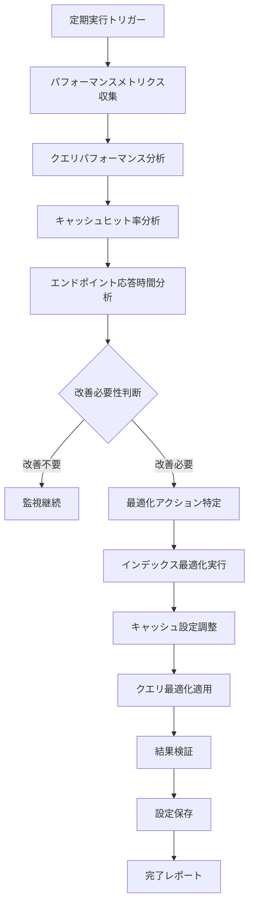
実行条件
- 日次定期実行（深夜）
- パフォーマンス低下検出時

主要処理
- パフォーマンスメトリクス収集
  - データベースクエリ実行時間
  - キャッシュヒット率
  - APIエンドポイント応答時間
  - メモリ使用率
- 問題領域の特定
- 最適化アクションの決定
- 最適化の実行
  - インデックス調整
  - キャッシュ設定変更
  - クエリ書き換え
- 効果検証
- 設定の保存

### 5.3 自動バックアップフロー
データの定期バックアップを行うフロー。
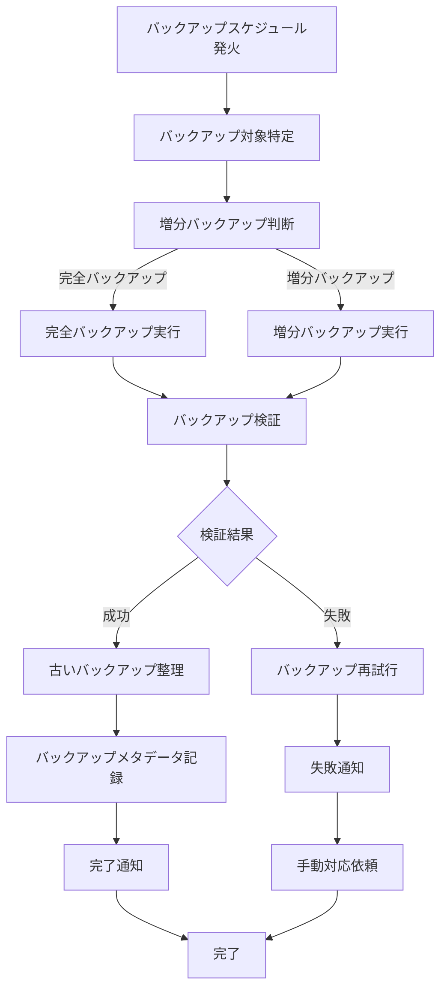
実行条件
- 完全バックアップ：週次（日曜日 AM 2:00）
- 増分バックアップ：日次（AM 2:00）
- 重要データ更新後

主要処理
- バックアップ対象の特定
  - データベース
  - メディアファイル
  - 設定ファイル
- バックアップタイプの判断
- バックアップ実行
- バックアップの整合性検証
- 古いバックアップの整理（保持ポリシーに基づく）
- バックアップメタデータの記録

## 6. 自動化システム間の連携
### 6.1 主要イベントフロー
システム全体における主要イベントの流れを示す。
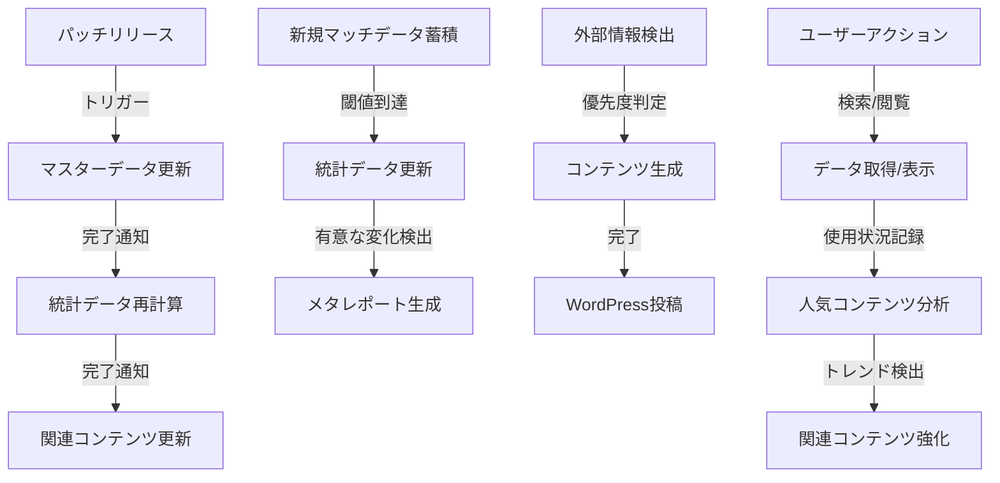

### 6.2 エラーハンドリングフロー
エラー発生時の処理フローを示す。
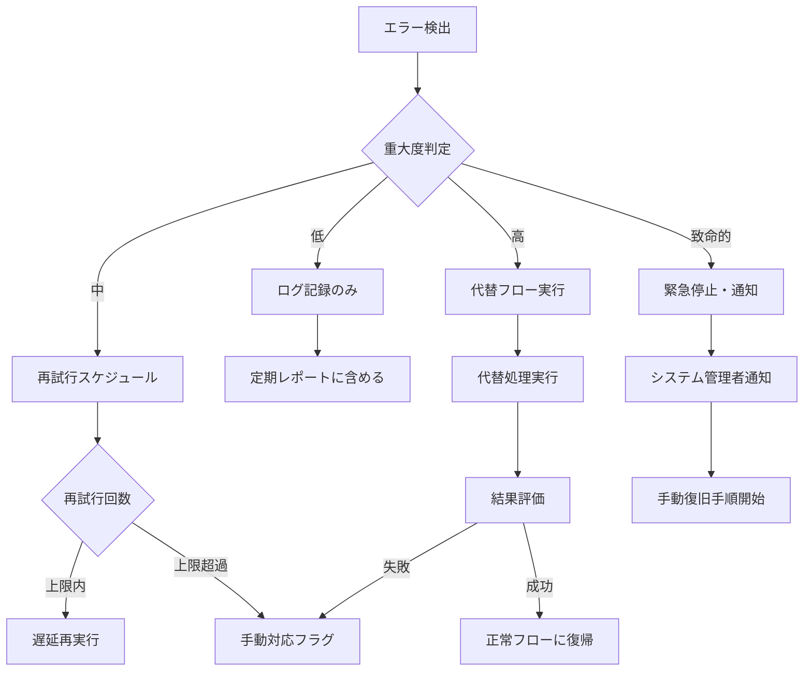

### 6.3 スケジューリングマトリクス
各自動化ジョブの実行スケジュールの概要。

| ジョブ名 | 実行頻度 | 優先度 | 依存関係 | 実行時間帯 |
|---------|---------|--------|---------|----------|
| マスターデータ更新 | 毎日+パッチ検出時 | 最高 | なし | 深夜 |
| 統計データ計算 | 日次 | 高 | マスターデータ | 深夜 |
| 外部情報収集 | ソース別（1-12時間） | 中 | なし | 分散 |
| AIコンテンツ生成 | イベント駆動 | 中 | 情報収集 | 分散 |
| WordPress投稿 | イベント駆動+スケジュール | 中 | コンテンツ生成 | コンテンツ種別による |
| API使用状況監視 | 1時間ごと | 高 | なし | 常時 |
| パフォーマンス最適化 | 日次 | 低 | なし | 深夜 |
| バックアップ | 日次/週次 | 高 | なし | 深夜 |
| エラー通知処理 | イベント駆動 | 最高 | なし | 常時 |

## 7. 自動化システムの監視と改善
### 7.1 KPI監視フロー
自動化システム自体のパフォーマンスを測定するKPI監視フロー。
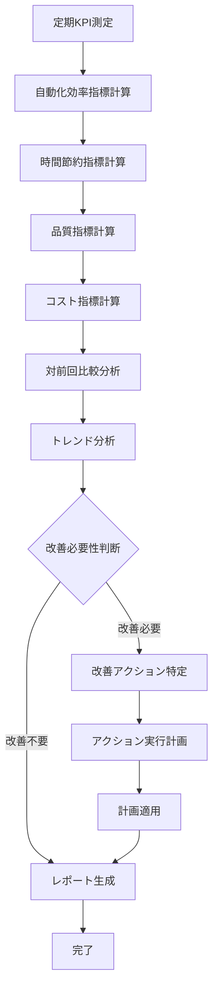

### 7.2 主要KPI指標
自動化システムの効果を測定するための主要KPI。

| KPI | 説明 | 目標値 | 測定頻度 |
|-----|------|-------|---------|
| コンテンツ生成効率 | 1時間あたりの生成記事数 | >3記事/時間 | 週次 |
| 自動化率 | 手動操作なしで完了したタスクの割合 | >95% | 週次 |
| エラー率 | 発生したエラーの割合 | <2% | 日次 |
| コンテンツ品質スコア | AIによる品質評価スコア | >85/100 | 記事ごと |
| API効率 | 単位コストあたりのデータ取得量 | 前月比+5% | 月次 |
| システム応答時間 | 平均エンドポイント応答時間 | <200ms | 日次 |
| 自動リカバリー率 | エラーから自動回復した割合 | >90% | 週次 |

## 8. 最終的な自動化フロー図
システム全体の自動化フローの関連性を示す。
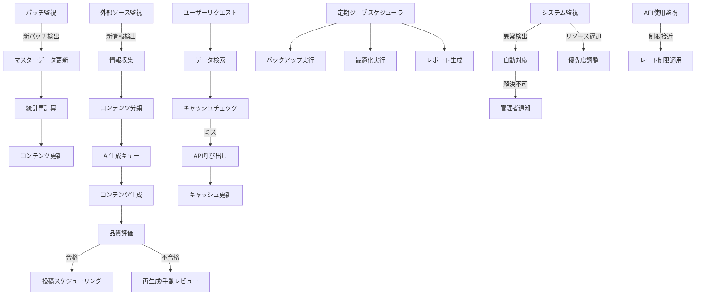

## 9. デプロイと運用
### 9.1 自動化コンポーネントのデプロイ方法

- バックエンドジョブ：Dockerコンテナ化、Kubernetes上での運用
- データ処理バッチ：AWS Lambda/GCP Functionsでのサーバーレス実行
- スケジューラ：cron + CloudWatch/Cloud Scheduler
- WordPress連携：カスタムプラグインとして実装

### 9.2 運用監視体制

- CloudWatch/Cloud Monitoringによるメトリクス監視
- Grafanaダッシュボードによる可視化
- Slackへのアラート通知
- 日次/週次サマリーレポート自動生成

### 9.3 障害対応プラン
| 障害種別 | 自動対応 | 手動対応トリガー | 復旧目標時間 |
|---------|----------|----------------|-------------|
| Riot API障害 | キャッシュ延長、機能制限 | 12時間以上継続 | 24時間以内 |
| OpenAI API障害 | 投稿キュー保留、定型文代替 | 3時間以上継続 | 6時間以内 |
| DB接続障害 | 読み取り専用モード | 即時 | 2時間以内 |
| WordPress連携障害 | 投稿キュー保留 | 6時間以上継続 | 12時間以内 |
| スクレイピング障害 | ソース切り替え | 24時間以上継続 | 48時間以内 |

## 10. 将来の拡張性
### 10.1 自動化システムの拡張計画

- 機械学習モデルによる品質予測の導入
- 複数言語対応の自動化
- ユーザーインタラクションに基づくコンテンツ生成
- 予測分析による先行コンテンツ生成

### 10.2 統合検討中のサードパーティサービス

- Discord Botとの連携（リアルタイム通知）
- Twitterなどのソーシャルメディア自動投稿
- YouTube動画サマリーの自動生成
- Twitch配信分析との連携